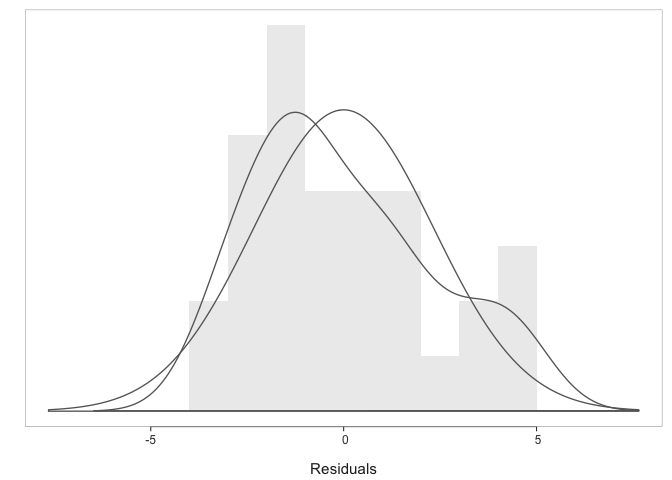
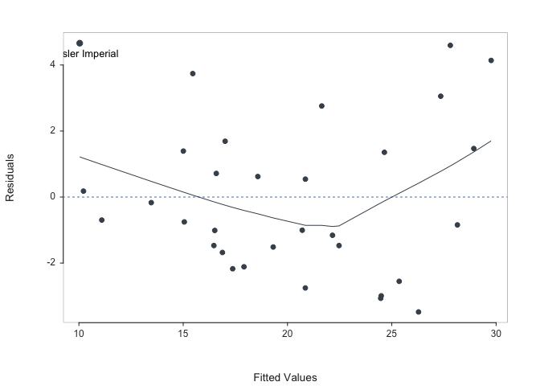
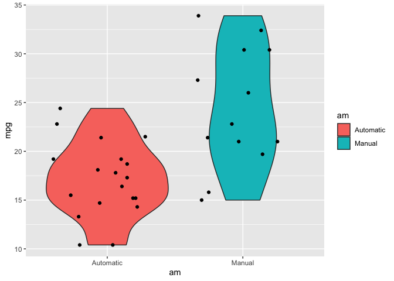

# Executive Summary

In this assignment, we are using the mtcars data set, to study the relationship between a car’s transmission and the number of miles per gallon of gasoline, along with a set of other variables that could affect this relationship.

##### The analysis comprises of these stages:

- Data Processing and Exploratory Data Analysis  

- Model selection and Regression Analysis  

- Residual Analysis

##### The analysis is focused on answering two questions:

1. Is an automatic or manual transmission better for MPG?

2. Quantify the MPG difference between automatic and manual transmissions.

**Conclusion:** Both models support the conclusion that the cars in the data set with manual transmissions have higher miles per gallon (MPG) than those cars in the data set with automatic transmission systems. Manual transmission delivers 2.94 more mpg than automatic transmission (using the multi-variate model). However, other variables (weight and acceleration time) do have significant influence on this correlation and further investigation and multi-variate modelling is recommended.


## Exploratory Data Analysis


There are 32 observations (rows) and each row is for a car type. There are 11 variables (columns) (Appendix A). 

* mpg Miles/(US) gallon  
* cyl Number of cylinders  
* disp Displacement (cu.in.)  
* hp Gross horsepower  
* drat Rear axle ratio  
* wt Weight (1000 lbs)  
* qsec 1/4 mile time  
* vs Engine (0 = V-shaped, 1 = straight)  
* am Transmission (0 = automatic, 1 = manual)  
* gear Number of forward gears  
* carb Number of carburetors  

Since am is a factor variable, we need to modify the numeric value to categorical one. Then we will check out how the distribution of fuel consumption (mpg) varies by transmission types (am) in ggplot. 


```r
# data
data("mtcars")

# data preparation
mtcars$am <- as.factor(mtcars$am) # make "am" a factor variable
levels(mtcars$am) <- c("Automatic", "Manual")
```

As seen from the graph (Appendix B), vehicles with manual transmission have a higher mpg than automatic transmission. Since our sample size is too small (32 observations), we can carry out t-test to test the significance of the relationship. 


```r
# T test the difference between transmissions in terms of MPG
t.test<- t.test(mpg~am,data=mtcars); t.test$p.value
```

```
## [1] 0.001373638
```

The t-test is for the null hypothesis “there is no correlation between transmission type and mpg”.   
Nevertheless, the p-value (0.001373638) is less than 0.05, which indicates that the null hypothesis is rejected. The alternative hypothesis - a significant difference (correlation) of mpg between automatic and manual transmissions is now examined.

## Model Building

While we know there is a difference between transmission types in terms of fuel consumption, we do not know what are the best predictors of MPG. To identify the best fit, we first include all variables in our dataset and then we will conduct model building analysis with step() function.   

The aim of the function is to identify lowest AIC scores in given model. While there are different ways of applying step() function (forward, backward, both), the basic difference is that in the backward selection procedure you can only discard variables from the model at any step, whereas in stepwise selection you can also add variables to the model.


```r
# linear model including all variables
model = lm(mpg ~ ., data = mtcars)
```

As we can see from the appendix C, the AIC of the model decreases every time we remove a suggested variable. The Backward Elimination Procedure stops when there are no more variables to remove ( AIC = 61.31). And removing one more variable would result in a higher AIC.


## Regression Analysis

We will use lessR package to conduct regression analysis. The standard output (Appendix D) provides extensive summary, including estimated model, fit indices, ANOVA, correlation matrix, collinearity analysis, best subset regression, residuals and influence statistics, and prediction intervals.  


```r
# converting data into LessR
d <- mtcars

r <- reg(mpg ~ wt + qsec + am)
```

<!-- --><!-- -->


Here just display the estimates as part of the standard text output.


```r
r$out_estimates
```

```
##              Estimate    Std Err  t-value  p-value   Lower 95%   Upper 95%
## (Intercept)     9.618      6.960    1.382    0.178      -4.638      23.874
##          wt    -3.917      0.711   -5.507    0.000      -5.373      -2.460
##        qsec     1.226      0.289    4.247    0.000       0.635       1.817
##    amManual     2.936      1.411    2.081    0.047       0.046       5.826
```


## Model results 

* According to the R-squared value, our best model fit explains 85% of the variability in MPG outcome with the regressors weight (wt), 1/4 mile time (qsec), and transmission (am).  

* The Adjusted R-squared is 83%, which is close to the R-squared value. This means that if we had unnecessary variables in our model, the difference between this two would be substantial.  

* We can see that all the p-values of the coefficients are smaller than 0.05 of significance. Which means that all the regressors are statistically significant, except the intercept.  

* The previous statement can be reinforced by the confidence intervals of the coefficients by not containing 0. Hence, these control variables have a statistically significant effect on the outcome.  

* The model as a whole is significant to explain the MPG outcome, as the P-value for the regression is 0.000, which is smaller than the significance level 0.05.  

* When the transmission am variable is 0 (automatic), the intercept of the model is 9.618 (coefficient of the reference variable). But when is equal to 1 (manual) the intercept of the model is 9.618 + 2.936 (coefficient of the reference variable + the coefficient of the manual transmission variable).  

* The t-test for the transmission am variable when is equal to 1 (manual), suggests that this variable is significantly different compared to when is equal to cero (automatic). We can then say that manual transmission has on average 30.53% (2.936 units) more miles per gallon compared to automatic transmission.  

* Holding 1/4 mile time qsec and Transmission am constant, as the weight of the car increases by 1 unit (1000 lbs), the miles per gallon, on an average, decreases by -3.917 miles per gallon.  

* Holding Weight wt and Transmission am constant, as the 1/4 mile time increases by 1 unit (1 second), the miles per gallon, on an average, increases by 1.226 miles per gallon.


## Residual Analysis

* The points in the Residuals vs. Fitted plot (Plot 2) seem to be randomly scattered, verifying the assumption of the homoscedasticity of errors. 

* Distribution of Residuals (Plot 1) is also in normal

* As seen in the Residuals and Influence table (Appendix D), all the Cook’s distances are less than 1, D<1. This means that our observations are not highly influential. 


## Conclusion

* Q1 - Manual transmission delivers a significantly higher mpg than automatic. Manual transmission is therefore ‘better’ in terms of mpg.  

* Q2 - Manual transmission delivers 2.94 more mpg than automatic transmission (using the multi-variate model). This has an adjusted r squared of 0.83 and a p-value below 0.05.  

It may be possible to improve on this with a further multi-variate model that also includes interactions between the variables using qsec (acceleration) and weight (wt). (However, the limits of report length (around 2 pages) and appendices (around 3 pages) for this assignment mean that this additional investigation is not included.)

### Appendix A  (Exploratory Data Analysis)


```r
# head of the data
 head(mtcars)
```

```
##                    mpg cyl disp  hp drat    wt  qsec vs        am gear carb
## Mazda RX4         21.0   6  160 110 3.90 2.620 16.46  0    Manual    4    4
## Mazda RX4 Wag     21.0   6  160 110 3.90 2.875 17.02  0    Manual    4    4
## Datsun 710        22.8   4  108  93 3.85 2.320 18.61  1    Manual    4    1
## Hornet 4 Drive    21.4   6  258 110 3.08 3.215 19.44  1 Automatic    3    1
## Hornet Sportabout 18.7   8  360 175 3.15 3.440 17.02  0 Automatic    3    2
## Valiant           18.1   6  225 105 2.76 3.460 20.22  1 Automatic    3    1
```

```r
# dimension
dim(mtcars)
```

```
## [1] 32 11
```


### Appendix B - Violin Plot


```r
# explanatory graph 
g <- ggplot(mtcars, aes(am, mpg))
g + geom_violin(aes(fill = am)) + geom_jitter(height = 0)
```

<!-- -->

### Appendix C Model Building


```r
# Running the Backward Elimination Procedure
final_model <- step(model, direction = "backward")
```

```
## Start:  AIC=70.9
## mpg ~ cyl + disp + hp + drat + wt + qsec + vs + am + gear + carb
## 
##        Df Sum of Sq    RSS    AIC
## - cyl   1    0.0799 147.57 68.915
## - vs    1    0.1601 147.66 68.932
## - carb  1    0.4067 147.90 68.986
## - gear  1    1.3531 148.85 69.190
## - drat  1    1.6270 149.12 69.249
## - disp  1    3.9167 151.41 69.736
## - hp    1    6.8399 154.33 70.348
## - qsec  1    8.8641 156.36 70.765
## <none>              147.49 70.898
## - am    1   10.5467 158.04 71.108
## - wt    1   27.0144 174.51 74.280
## 
## Step:  AIC=68.92
## mpg ~ disp + hp + drat + wt + qsec + vs + am + gear + carb
## 
##        Df Sum of Sq    RSS    AIC
## - vs    1    0.2685 147.84 66.973
## - carb  1    0.5201 148.09 67.028
## - gear  1    1.8211 149.40 67.308
## - drat  1    1.9826 149.56 67.342
## - disp  1    3.9009 151.47 67.750
## - hp    1    7.3632 154.94 68.473
## <none>              147.57 68.915
## - qsec  1   10.0933 157.67 69.032
## - am    1   11.8359 159.41 69.384
## - wt    1   27.0280 174.60 72.297
## 
## Step:  AIC=66.97
## mpg ~ disp + hp + drat + wt + qsec + am + gear + carb
## 
##        Df Sum of Sq    RSS    AIC
## - carb  1    0.6855 148.53 65.121
## - gear  1    2.1437 149.99 65.434
## - drat  1    2.2139 150.06 65.449
## - disp  1    3.6467 151.49 65.753
## - hp    1    7.1060 154.95 66.475
## <none>              147.84 66.973
## - am    1   11.5694 159.41 67.384
## - qsec  1   15.6830 163.53 68.200
## - wt    1   27.3799 175.22 70.410
## 
## Step:  AIC=65.12
## mpg ~ disp + hp + drat + wt + qsec + am + gear
## 
##        Df Sum of Sq    RSS    AIC
## - gear  1     1.565 150.09 63.457
## - drat  1     1.932 150.46 63.535
## <none>              148.53 65.121
## - disp  1    10.110 158.64 65.229
## - am    1    12.323 160.85 65.672
## - hp    1    14.826 163.35 66.166
## - qsec  1    26.408 174.94 68.358
## - wt    1    69.127 217.66 75.350
## 
## Step:  AIC=63.46
## mpg ~ disp + hp + drat + wt + qsec + am
## 
##        Df Sum of Sq    RSS    AIC
## - drat  1     3.345 153.44 62.162
## - disp  1     8.545 158.64 63.229
## <none>              150.09 63.457
## - hp    1    13.285 163.38 64.171
## - am    1    20.036 170.13 65.466
## - qsec  1    25.574 175.67 66.491
## - wt    1    67.572 217.66 73.351
## 
## Step:  AIC=62.16
## mpg ~ disp + hp + wt + qsec + am
## 
##        Df Sum of Sq    RSS    AIC
## - disp  1     6.629 160.07 61.515
## <none>              153.44 62.162
## - hp    1    12.572 166.01 62.682
## - qsec  1    26.470 179.91 65.255
## - am    1    32.198 185.63 66.258
## - wt    1    69.043 222.48 72.051
## 
## Step:  AIC=61.52
## mpg ~ hp + wt + qsec + am
## 
##        Df Sum of Sq    RSS    AIC
## - hp    1     9.219 169.29 61.307
## <none>              160.07 61.515
## - qsec  1    20.225 180.29 63.323
## - am    1    25.993 186.06 64.331
## - wt    1    78.494 238.56 72.284
## 
## Step:  AIC=61.31
## mpg ~ wt + qsec + am
## 
##        Df Sum of Sq    RSS    AIC
## <none>              169.29 61.307
## - am    1    26.178 195.46 63.908
## - qsec  1   109.034 278.32 75.217
## - wt    1   183.347 352.63 82.790
```

### Appendix D - Regression Analysis


```r
r
```

```
## >>> Suggestion
## # Create an R markdown file for interpretative output with  Rmd = "file_name"
## reg(mpg ~ wt + qsec + am, Rmd="eg")  
## 
## 
##   BACKGROUND
## 
## Data Frame:  d 
##  
## Response Variable: mpg 
## Predictor Variable 1: wt 
## Predictor Variable 2: qsec 
## Predictor Variable 3: am 
##  
## Number of cases (rows) of data:  32 
## Number of cases retained for analysis:  32 
## 
## 
##   BASIC ANALYSIS
## 
##              Estimate    Std Err  t-value  p-value   Lower 95%   Upper 95% 
## (Intercept)     9.618      6.960    1.382    0.178      -4.638      23.874 
##          wt    -3.917      0.711   -5.507    0.000      -5.373      -2.460 
##        qsec     1.226      0.289    4.247    0.000       0.635       1.817 
##    amManual     2.936      1.411    2.081    0.047       0.046       5.826 
## 
## 
## Standard deviation of residuals:  2.459 for 28 degrees of freedom 
##  
## R-squared:  0.850    Adjusted R-squared:  0.834    PRESS R-squared:  0.795 
## 
## Null hypothesis that all population slope coefficients are 0:
##   F-statistic: 52.750     df: 3 and 28     p-value:  0.000 
## 
## 
##             df    Sum Sq   Mean Sq   F-value   p-value 
##        wt    1   847.725   847.725   140.214     0.000 
##      qsec    1    82.858    82.858    13.705     0.001 
##        am    1    26.178    26.178     4.330     0.047 
##  
## Model        3   956.761   318.920    52.750     0.000 
## Residuals   28   169.286     6.046 
## mpg         31  1126.047    36.324 
## 
## 
##   K-FOLD CROSS-VALIDATION
## 
##   RELATIONS AMONG THE VARIABLES
## 
## >>> No correlations reported, not all variables are numeric. 
## 
## 
## >>> No collinearity analysis, not all variables are numeric.
##  
## 
## 
## >>> No subset analysis, not all variables are numeric.
##  
## 
## 
##   RESIDUALS AND INFLUENCE
## 
## Data, Fitted, Residual, Studentized Residual, Dffits, Cook's Distance 
##    [sorted by Cook's Distance] 
##    [res_rows = 20, out of 32 rows of data, or do res_rows="all"] 
## ------------------------------------------------------------------------------------ 
##                         wt   qsec        am    mpg fitted  resid rstdnt dffits cooks 
##    Chrysler Imperial 5.345 17.420 Automatic 14.700 10.039  4.661  2.323  1.268 0.348 
##             Merc 230 3.150 22.900 Automatic 22.800 25.354 -2.554 -1.251 -0.813 0.162 
##             Fiat 128 2.200 19.470    Manual 32.400 27.805  4.595  2.122  0.812 0.146 
##       Toyota Corolla 1.835 19.900    Manual 33.900 29.762  4.138  1.905  0.789 0.142 
##         Lotus Europa 1.513 16.900    Manual 30.400 27.345  3.055  1.378  0.603 0.088 
##        Toyota Corona 2.465 20.010 Automatic 21.500 24.494 -2.994 -1.351 -0.598 0.087 
##           Volvo 142E 2.780 18.600    Manual 21.400 24.467 -3.067 -1.353 -0.510 0.063 
##           Datsun 710 2.320 18.610    Manual 22.800 26.281 -3.481 -1.523 -0.495 0.058 
##     Pontiac Firebird 3.845 17.050 Automatic 19.200 15.460  3.740  1.621  0.438 0.045 
##       Ford Pantera L 3.170 14.500    Manual 15.800 17.914 -2.114 -0.940 -0.422 0.045 
##              Valiant 3.460 20.220 Automatic 18.100 20.854 -2.754 -1.188 -0.390 0.038 
##            Merc 240D 3.190 20.000 Automatic 24.400 21.642  2.758  1.186  0.378 0.035 
##        Maserati Bora 3.570 14.600    Manual 15.000 16.470 -1.470 -0.658 -0.320 0.026 
##          AMC Javelin 3.435 17.300 Automatic 15.200 17.372 -2.172 -0.920 -0.275 0.019 
##          Honda Civic 1.615 18.520    Manual 30.400 28.932  1.468  0.629  0.231 0.014 
##    Hornet Sportabout 3.440 17.020 Automatic 18.700 17.010  1.690  0.715  0.229 0.013 
##            Mazda RX4 2.620 16.460    Manual 21.000 22.470 -1.470 -0.618 -0.189 0.009 
##        Porsche 914-2 2.140 16.700    Manual 26.000 24.645  1.355  0.572  0.185 0.009 
##   Cadillac Fleetwood 5.250 17.980 Automatic 10.400 11.098 -0.698 -0.317 -0.172 0.008 
##          Merc 450SLC 3.780 18.000 Automatic 15.200 16.879 -1.679 -0.695 -0.165 0.007 
## 
## 
##   FORECASTING ERROR 
## 
## Data, Predicted, Standard Error of Forecast, 
## 95% Prediction Intervals 
##    [sorted by lower bound of prediction interval] 
##    [to see all intervals do pred_rows="all"] 
##  ----------------------------------------------
## 
##                          wt   qsec        am    mpg   pred    sf pi.lwr pi.upr  width 
##     Chrysler Imperial 5.345 17.420 Automatic 14.700 10.039 2.727  4.454 15.624 11.170 
##   Lincoln Continental 5.424 17.820 Automatic 10.400 10.220 2.765  4.557 15.883 11.326 
##    Cadillac Fleetwood 5.250 17.980 Automatic 10.400 11.098 2.724  5.518 16.677 11.158 
## ... 
##            Merc 450SL 3.730 17.600 Automatic 17.300 16.585 2.529 11.404 21.766 10.362 
##           Merc 450SLC 3.780 18.000 Automatic 15.200 16.879 2.523 11.711 22.048 10.337 
##     Hornet Sportabout 3.440 17.020 Automatic 18.700 17.010 2.570 11.745 22.275 10.530 
## ... 
##         Porsche 914-2 2.140 16.700    Manual 26.000 24.645 2.573 19.374 29.915 10.540 
##              Merc 230 3.150 22.900 Automatic 22.800 25.354 2.800 19.617 31.090 11.472 
##            Datsun 710 2.320 18.610    Manual 22.800 26.281 2.574 21.009 31.553 10.543 
## 
## 
## ---------------------------------- 
## Plot 1: Distribution of Residuals 
## Plot 2: Residuals vs Fitted Values 
## ----------------------------------
```

